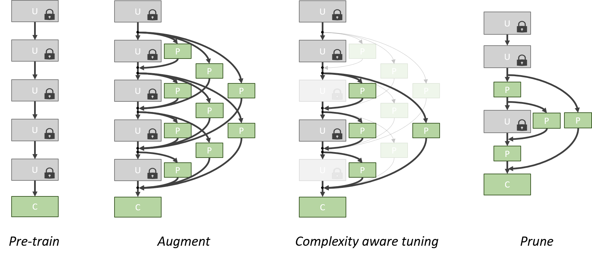

# NetTailor [[Project Page]](https://pedro-morgado.github.io/nettailor/)

This repository contains the source code accompanying our CVPR 2019 paper.

**NetTailor: Tuning the architecture, not just the weights**  
[Pedro Morgado](http://www.svcl.ucsd.edu/~morgado), [Nuno Vasconcelos](http://www.svcl.ucsd.edu/~nuno).  
In Computer Vision and Pattern Recognition, 2019.
[[Arxiv]](https://arxiv.org/abs/)

```
@inproceedings{morgado_nettailor,
	title={NetTailor: Tuning the architecture, not just the weights},
	author={Pedro Morgado and Nuno Vasconcelos},
	booktitle={Computer Vision and Pattern recognition (CVPR)},
	year={2019}
}
```

### Requirements
1. pytorch & torchvision
2. COCO API (from https://github.com/cocodataset/cocoapi)

###  Getting started
Download and prepare demo datasets: SVHN, Flowers and Pascal VOC.
```bash
>> cd data && python prepare_data.py
```

If interested in Visual Decathlon results, please download data and models.
```bash
>> cd data && python download_decathlon.py && cd ../checkpoints && python download_models.py
```

### Training NetTailor
We demonstrate on three demo datasets how to use the NetTailor procedure to adapt the network architecture to a target task.

##### Code tour
1. ``dataloaders.py``: Dataloaders for demo datasets.
1. ``nettailor.py`` and ``resnet.py``: Model definition for the student and teacher networks, respectively, based on resnet backbone.
1. ``main_student.py`` and ``main_teacher.py``: Training and evaluation code for the student and teacher networks, respectively.

**Usage:** Refer to the three ``demo_xxx.py`` scripts. These demonstrates how to 1) train the teacher network, 2) train the student network and 3) prune and retrain the student. 

To execute with default parameters, simply run:
```bash
>> python demo_svhn.py
>> python demo_flowers.py
>> python demo_voc12.py
```

**Disclaimer:** 
After publication, we modified the dataloader for the VOC12 and SVHN datasets to remove random cropping. This resulted in better performance than published results.

### NetTailor on Visual Decathlon Challenge and trained models
We also release the final models obtained in the visual decathlon challenge. Universal blocks can be downloaded [here](http://www.svcl.ucsd.edu/~morgado/nettailor/data/wide_resnet26.pth.tar) and task-specific blocks [here](http://www.svcl.ucsd.edu/~morgado/nettailor/data/decathlon_models.tar.gz).

##### Code tour
1. ``decathlon_dataloaders.py``: Dataloaders for visual decathlon data.
1. ``wide_nettailor.py`` and ``wide_resnet.py``: Model definition for the student and teacher networks, respectively, based on wide resnet backbone.
1. ``main_student_decathlon.py`` and ``main_teacher_decathlon.py``: Training and evaluation code for the student and teacher networks, respectively. 

**Usage:**  Refer to the ``deploy_decathlon.ipynb`` notebook for a usage example. This notebook also showcases some predictions obtained with models trained with NetTailor on all nine datasets.

If you encounter any issue when using our code or model, please let me know.